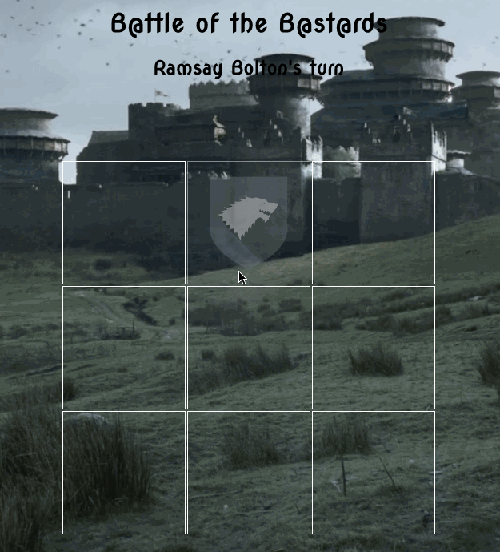

# Tic Tac Toe

You get it.  Tic-Tac-Toe.  This one I did in the theme of my favorite book and tv series.  I used some pretty basic vanilla JS to do this one.  *'If statements'* to determine whose turn it is or whether or not there was a winner.  A *'for loop'* to map out the possible wins and throw a modal after all possible game plays are completed with an option to reset the game.  We used JS to see if there was a winner or loser based on moves, and an array of win possibilities.  the changed the class on the body to display the modal.  Prety basi stuff, but a lot o fun to figure out how to do it.
